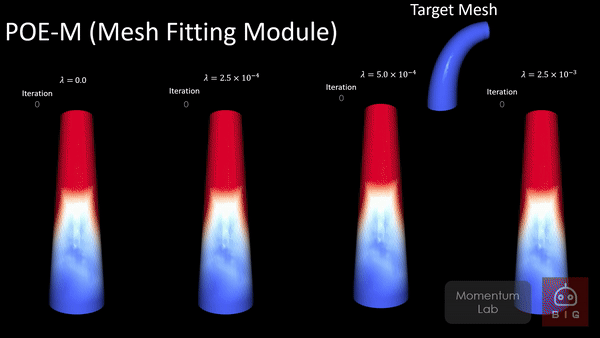
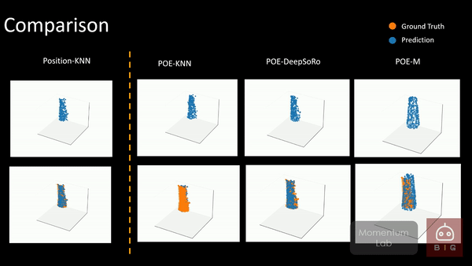

# POE
This is the official repository for the manuscript "POE: Acoustic Soft Robotic Proprioception for Omnidirectional End-effectors."  

## Abstract
Soft robotic shape estimation and proprioception are challenging because of soft robot's complex deformation behaviors and infinite degrees of freedom. A soft robot's continuously deforming body makes it difficult to integrate rigid sensors and to reliably estimate its shape. In this work, we present Proprioceptive Omnidirectional End-effector (POE), which has six embedded microphones across the tendon-driven soft robot's surface. We first introduce novel applications of previously proposed 3D reconstruction methods to acoustic signals from the microphones for soft robot shape proprioception. To improve the proprioception pipeline's training efficiency and model prediction consistency, we present POE-M. POE-M first predicts key point positions from the acoustic signal observations with the embedded microphone array. Then we utilize an energy-minimization method to reconstruct a physically admissible high-resolution mesh of POE given the estimated key points. We evaluate the mesh reconstruction module with simulated data and the full POE-M pipeline with real-world experiments. We demonstrate that POE-M's explicit guidance of the key points during the mesh reconstruction process provides robustness and stability to the pipeline with ablation studies. POE-M reduced the maximum Chamfer distance error by 23.10 $\%$ compared to the state-of-the-art end-to-end soft robot proprioception models and achieved 4.91 mm average Chamfer distance error during evaluation. 

## Results






## Code
Under preparation.

## Requirement

python>=3.6

pytorch>=1.4

pytorch3d>=0.2.0

open3d>=0.10.0


## Dataset
Under preparation

## CAD Files
Under preparation

##Instructions


## Citation
If POE has been useful in your research, please consider citing:
```BibTex
under review
```
